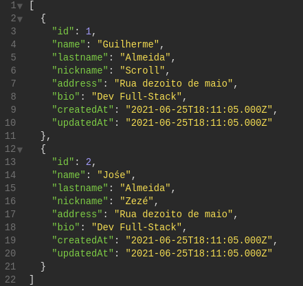
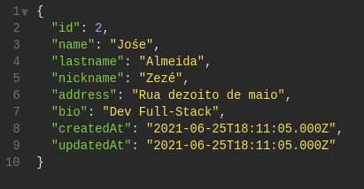
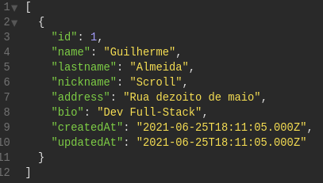
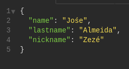
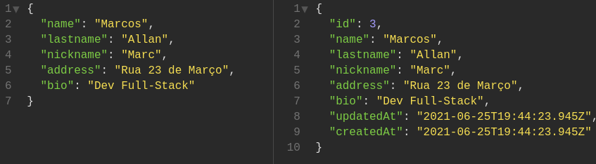
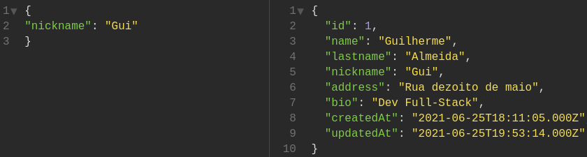
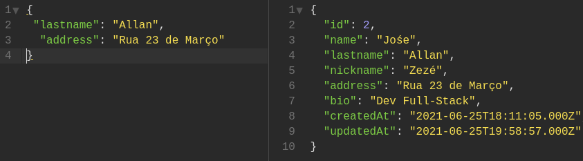

<body>
  

    <h1>Rodar a aplicação</h1>
    <h4>Crie um arquivo <mark><code>.env</code></mark> na raíz do projeto com as informações do seu banco MySql como
      descrito abaixo:</h4>
    <code>HOSTNAME='localhost'</code> 
    <code> MYSQL_USER='root'</code> 
    <code> MYSQL_PASSWORD='Senha'</code> 
    <code> MYSQL_NAME='Test-Nodejs'</code> 
    <h3>No terminal rode os seguintes comandos:</h3>
    <h4> <code>npm install</code></h4>
    <h4> <code>npx sequelize-cli db:create</code></h4>
    <h4> <code>npx sequelize-cli db:migrate</code></h4>
    <h4> <code>npx sequelize-cli db:seed:all</code></h4>
    <h4> <code>npm start</code></h4>
  

    

    <h1>Verificar cobertura de testes</h1>
  <h4> <code>npm run test-coverage</code></h4>
  

  

    <h1>Requisições</h1>
    <h2>Exemplos</h2>
    

      

        <h3>GET <code>/users</code> Retorna todos os usuários cadastrados.</h3>
         
        
      

      

        <h3>GET <code>/users/2</code> Retorna o usuário pelo campo "id".</h3>
         
        
      

      

        <h3>GET <code>/users/search?q=Guilherme</code> Retorna o usuário pelo campo "nome" ou "lastname".</h3>
         
        
      

      

        <h3>GET <code>/users/nickname?q=Zeze</code> Retorna o usuário pelo campo "nickname".</h3>
         
        
      

      

        <h3>POST <code>/users/register</code> Cadastra e retorna o usuário informado pelo corpo da requisição.</h3>
         
        
      

      

        <h3>PUT <code>/users/register</code> Atualiza o nickname informado pelo corpo da requisição e retorna o usuário
          atualizado.</h3>
         
        
      

      

        <h3>PUT <code>/users/2</code> Atualiza o lastname e address informado pelo corpo da requisição e retorna o usuário
          atualizado.</h3>
         
        
      

      

        <h3>DELETE <code>/users/3</code> Deleta o usuário pelo id e não tem retorno.</h3>
         
      

    

  

</body>